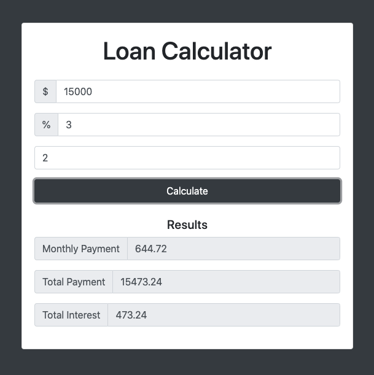

## Loan Calculator 
https://milano-patel.github.io/loan-calculator/

## Project Specifications
- User can select Loan Amount, Interest Rates and number of years
- Loading Animation

## Code Credit and Inspiration
Credit: Created while Learning the Javascript from Brad Traversy's Udemy Course: https://www.udemy.com/course/web-projects-with-vanilla-javascript/

## Screenshot:

